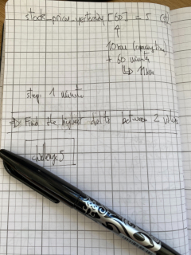

# challenge5

## Scenario

Suppose we could access yesterday's stock prices as a list, where:

* The indices are the time in minutes past trade opening time, which was 10:00am local time.
* The values are the price in dollars of the Latitude Financial stock at that time.
* So if the stock cost $5 at 11:00am, stock_prices_yesterday[60] = 5.

Write an *efficient function* that takes an array of stock prices and returns the best profit I could have made from 1 purchase and 1 sale of 1 Latitude Financial stock yesterday.

For example:
```js
var stock_prices_yesterday = [10, 7, 5, 8, 11, 9];

get_max_profit(stock_prices_yesterday)
# returns 6 (buying for $5 and selling for $11)
```

You must buy before you sell.
You may not buy and sell in the same time step (at least 1 minute must pass).

## Work log

Here is a detailed recount of what I did in order to complete that work:

* I created a new GitHub repository,
* I took a pen, some paper and I wrote down the data that seemed relevant to me in my attempt to synthesize the problem at hand:
    * 
* Once I did that, I came up with a search string for Google:
    * `Find the highest delta between 2 values in python`
* I then googled the problem in my own terms,
* I got an interesting [link poiting to GeeksforGeeks](https://www.geeksforgeeks.org/maximum-difference-between-two-elements/),
* I created a short Python file to implement the solution proposed,
* I tested it against a variety of inputs:
    * `stock_prices_yesterday = [55, 55, 56, 57, 57, 57, 57, 62, 63, 64, 79, 80]`
    * `stock_prices_yesterday = [1, 2, 90, 10, 110]`
    * `stock_prices_yesterday = [10, 7, 5, 8, 11, 9]`
* I validated that it works as expected,
* I pushed all this to *master*,
* You now probably wonder if this is cheating or not, but you already know the answer: you do the same on a regular basis, like 100% of coders out there,
* Actually this is an industry-wide practice that we better keep secret,
* Now you decide if you will be the one breaking the news to the world or simply carry on with your day after shooting an email stating "His code is brilliant, he is the one".